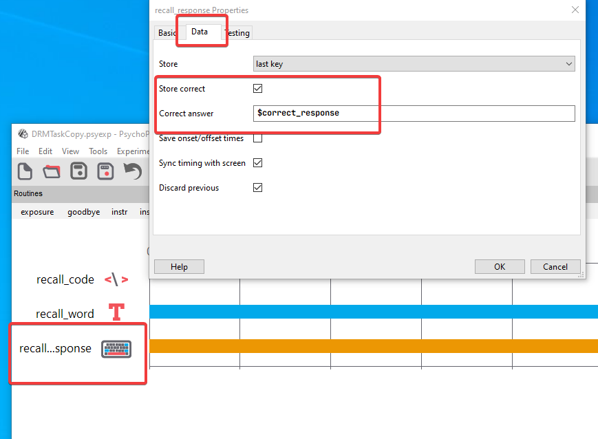

# Solution for Feedback Challenge{#feedback}

:::: {.bluebox}
Add feedback for the recall phase.
::::

1. First, locate the routine for the `recall` phase.

{width="100%"}

Then click on `recall_response` and select the `data` tab to see that we are recording accuracy for this response with reference to a variable called `correct_response`.

{width="100%"}

This gives us access to a variable called `recall_response.corr` which is `0` in the event that the trial was incorrect and `1` in the event that the trial was answered correctly.

Now we can insert a routine that presents feedback if the current phase is `recall`

Click on `insert routine`, and name it `recall_feedback`.

Use the cursor to place the routine just after `recall`.

Add a text component that says "Correct" and make it start on the condition that `recall_response.corr == 1`.

Add a text component that says "Wrong!" and make it start on the condition that `recall_response.corr == 0`.

Finally, add a code compnent that says, effectively, _"skip this routine if we are in an exposure trial"_
